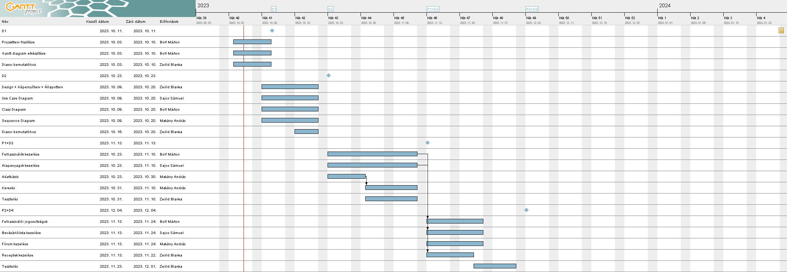

# Jövő receptes oldala Projektterv 2023

## 1. Összefoglaló 

Egy recept weboldal fontos, mert egy óriási és elérhető gyűjteményt kínál az ételek elkészítéséhez szükséges tudnivalókból, lehetőséget adva a felhasználóknak, hogy felfedezzék a különböző konyhákat és főzési technikákat. Egyszerűsíti az étkezési tervezést és előkészületeket, hiszen lépésről lépésre történő utasításokat és összetevőlistákat kínál, mellyel időt és energiát spórol a tapasztalt és kezdő szakácsoknak egyaránt. Emellett a recept weboldalak gyakran közösségi élményt teremtenek, ahol a felhasználók megoszthatják tippeiket, módosításaikat és visszajelzéseiket, elősegítve a közös és gazdagító főzési élményt. Végül ezek a platformok gyakran a felhasználók által létrehozott tartalmakkal segítik az otthoni szakácsok kreativitását és alkalmazkodóképességét, inspirálva másokat az konyhában való kísérletezésre és innovációra.

## 2. A projekt bemutatása

Ez a projektterv a ,,Jövő Receptes oldala" projektet mutatja be, amely 2023-09-20-től 2023-12-04- ig tart, azaz összesen 75 napon keresztül fog futni. A projekten négy fejlesztő fog dolgozni, az elvégzett feladatokat pedig négy alkalommal fogjuk prezentálni a megrendelőnek, annak érdekében, hogy biztosítsuk a projekt folyamatos előrehaladását.

### 2.1. Rendszerspecifikáció

A receptes oldal legfőbb funkciója a termékek szerinti keresés lesz. A felhasználó egy hatalmas listából választhatja ki az otthon lévő alapanyagokat és eszközöket. Az oldal ezek alapján megfelelő receptet ajánl fel, melyet a felhasználó el tud készíteni. A "Lepj meg" funkcióban véletlenszerű recepteket lehet látni, amelyekhez a hiányzó termékeket egy oldalon belüli bevásárlólistába lehet felvinni. A felhasználók feltölthetnek recepteket, képeket, adhatnak hozzászólásokat és kedveléseket, mindenközben jelvényeket szerezve és szintet lépve. Széleskörű oktatóvideó tárunk és a közösségi fórum segítségével pedig új konyhai praktikákat sajátíthat el a felhasználó. A megrendelő kérésére ezen felül mobiltelefonos készülékek képernyőjéhez is igazítjuk az oldalt. 

### 2.2. Funkcionális követelmények

- Felhasználók kezelése (admin, felhasználó) (CRUD)
- Felhasználói munkamenet megvalósítása több jogosultsági szinttel 
- Receptek kezelése (CRUD)
- Alapanyagok kezelése (CRUD)
- Biztonsági mentés automatikus létrehozása
- Bevásárlólista kezelése (CRUD)
- Fórumbejegyzések kezelése (CRUD)

### 2.3. Nem funkcionális követelmények

 - A kliens oldal böngészőfüggetlen legyen
 - A kliens oldal eszközfüggetlen legyen
 - Reszponzív megjelenés
 - Az érzékeny adatokat biztonságosan tároljuk
 - A legfrissebb technológiákat használja a rendszer

## 3. Költség- és erőforrás-szükségletek

Az erőforrásigényünk összesen 68.5 személynap, átlagosan 17 személynap/fő.

A rendelkezésünkre áll összesen 4 * 70 = 280 pont.

## 4. Szervezeti felépítés és felelősségmegosztás

A projekt megrendelője Dr. Vidács László. A ,,Jövő Receptes oldala" projektet a projektcsapat fogja végrehajtani, amely jelenleg négy fejlesztőből áll. A csapatban található tapasztalt és pályakezdő webprogramozó is. A tapasztalt projekttagok több éve dolgoznak az iparban, számos sikeres projektten vannak túl.

- Bolf Márton (1 év fejlesztői tapasztalat)
- Dajcs Trisztán Sámuel (<1 év progamozói tapasztalat)
- Makány András (5 év programozói-, 1 év backend fejlesztői tapasztalat)
- Zeöld Blanka (<1 év tapasztalat)

### 4.1 Projektcsapat

A projekt a következő emberekből áll:

| Név                   | Pozíció          | E-mail cím             |
| --------------------- | ---------------- | ---------------------- |
| Bolf Márton           | Projektmenedzser | bolf.marci@gmail.com   |
| Dajcs Trisztán Sámuel | Projekt tag      | dajcs.samu@hotmail.com |
| Makány András         | Projekt tag      | andrasmakany@gmail.com |
| Zeöld Blanka          | Projekt tag      | zeoldblanka@gmail.com  |

## 5. A munka feltételei

### 5.1. Munkakörnyezet

A projekt a következő munkaállomásokat fogja használni a munka során:

 - Munkaállomások: 4 db, Windows 10-es (2 db) és 11-es (2 db) operációs rendszerrel
 - Dell G15 (CPU: i5-11400H, RAM: 32 GB, GPU: NVIDIA GeForce 3050)
 - MSI Katana GF66 12UE (CPU: i5-12500H, RAM: 16 GB, GPU: NVIDIA GeForce 3060)
 - Asztali gép (CPU: i5-4690K, RAM: 8GB, GPU: NVIDIA GeForce 1060)
 - Lenovo Thinkpad 23258J6 (CPU: i5-3320M, RAM: 4096 MB, GPU: Intel(R) HD Graphics 4000)

A projekt a következő technológiákat/szoftvereket fogja használni a munka során: 

 - Git verziókövető (GitLab)
 - MariaDB DBMS

### 5.2. Rizikómenedzsment

| Kockázat                                  | Leírás                                                                                                                                                                                   | Valószínűség | Hatás     |
| ----------------------------------------- | ---------------------------------------------------------------------------------------------------------------------------------------------------------------------------------------- | ------------ | --------- |
| Betegség                                  | Súlyosságtól függően hátráltatja vagy bizonyos esetekben teljes mértékben korlátozza a munkavégzőt, így az egész projektre kihatással van. Megoldás: a feladatok átcsoportosítása        | nagy         | súlyos    |
| Kommunikációs fennakadás a csapattagokkal | A csapattagok között nem elégséges az információ áramlás, nem pontosan, esetleg késve vagy nem egyértelműen tájékoztatjuk egymást. Megoldás: még gyakoribb megbeszélések és ellenőrzések | kis          | mérsékelt |
| Munkaállomás meghibásodása                | Tagok által használt munkaállomások spontán meghibásodása. Megoldás: szervíz idejére átmeneti munkaállomás biztosítása                                                                   | kis          | súlyos    |

## 6. Jelentések

### 6.1. Munka menedzsment
A munkát `Bolf Márton` koordinálja. Fő feladata, hogy folyamatosan egyeztessen a csapattagokkal az előrehaladásról és a fellépő problémákról, esetlegesen a megoldásban is segítséget nyújhat a projekt csúszásának elkerülése végett. További feladata a heti szinten tartandó csoportgyűlések időpontjának és helyszínének leszervezése, erről több felületen is (Messenger, Discord)  tájékoztatja a projektcsapatot.

### 6.2. Csoportgyűlések

A projekt hetente ülésezik, hogy megvitassák az azt megelőző hét problémáit, illetve hogy megbeszéljék a következő hét feladatait. A megbeszélésről minden esetben memó készül.

1. megbeszélés:

- Időpont: 2023. 09. 26.
- Hely: Online
- Résztvevők: Bolf Márton, Dajcs Trisztán Sámuel, Makány András, Zeöld Blanka
- Érintett témák: Név és Logo, Csapattagok előismeretei, Tervezett funkciók (Szűrés, Fórum, Alapanyagok, Receptek, Bevásárló lista)

2. megbeszélés:

- Időpont: 2023. 10. 03.
- Hely: TIK -Szeged, Ady tér 10
- Résztvevők: Bolf Márton, Dajcs Trisztán Sámuel, Makány András, Zeöld Blanka
- Érintett témák: Feladatleosztások, M1 prezentáció

3. megbeszélés:

- Időpont: 2023. 10. 10.
- Hely: Online
- Résztvevők: Bolf Márton, Dajcs Trisztán Sámuel, Makány András, Zeöld Blanka
- Érintett témák: Feladatleosztások, diagramok elosztása

4. megbeszélés:

- Időpont: 2023. 10. 18.
- Hely: Online
- Résztvevők: Bolf Márton, Dajcs Trisztán Sámuel, Zeöld Blanka
- Érintett témák: Use Case Diagram kiegészítése, további diagramok készítésének ütemezése

5. megbeszélés:

- Időpont: 2023. 10. 24.
- Hely: Online
- Résztvevők: Bolf Márton, Dajcs Trisztán Sámuel, Makány András, Zeöld Blanka
- Érintett témák: Diagramok átnézése, programozási feladatok átbeszélése

6. megbeszélés:

- Időpont: 2023. 11. 01.
- Hely: Online
- Résztvevők: Bolf Márton, Dajcs Trisztán Sámuel, Makány András, Zeöld Blanka
- Érintett témák: Git működésének átbeszélése, Java Spring Boot, minta projekt átnézése

7. megbeszélés:

- Időpont: 2023. 11. 07.
- Hely: Online
- Résztvevők: Dajcs Trisztán Sámuel, Makány András, Zeöld Blanka
- Érintett témák: Adatbázis-kezelés (xampp), HTML-CSS alapok átbeszélése

### 6.3. Minőségbiztosítás

Az elkészült terveket a terveken nem dolgozó csapattársak közül átnézik, hogy megfelel-e a specifikációnak és az egyes diagramtípusok összhangban vannak-e egymással. A meglévő rendszerünk helyes működését a prototípusok bemutatása előtt a tesztelési dokumentumban leírtak végrehajtása alapján ellenőrizzük és összevetjük a specifikációval, hogy az elvárt eredményt kapjuk-e. További tesztelési lehetőségek: unit tesztek írása az egyes modulokhoz vagy a kód közös átnézése (code review) egy, a vizsgált modul programozásában nem résztvevő csapattaggal. Szoftverünk minőségét a végső leadás előtt javítani kell a rendszerünkre lefuttatott kódelemzés során kapott metrikaértékek és szabálysértések figyelembevételével.
Az alábbi lehetőségek vannak a szoftver megfelelő minőségének biztosítására:
- Specifikáció és tervek átnézése (kötelező)
- Teszttervek végrehajtása (kötelező)
- Unit tesztek írása (választható)
- Kód átnézése (választható)

### 6.4. Átadás, eredmények elfogadása

A projekt eredményeit a megrendelő, Dr. Vidács László fogja elfogadni. A projektterven változásokat csak a megrendelő írásos engedélyével lehet tenni. A projekt eredményesnek bizonyul, ha specifikáció helyes és határidőn belül készül el. Az esetleges késések pontlevonást eredményeznek. 
Az elfogadás feltételeire és beadás formájára vonatkozó részletes leírás a következő honlapon olvasható: https://okt.inf.szte.hu/rf1/

### 6.5. Státuszjelentés

Minden mérföldkő leadásnál a projekten dolgozók jelentést tesznek a mérföldkőben végzett munkájukról a a megadott sablon alapján. A gyakorlatvezetővel folytatott csapatmegbeszéléseken a csapat áttekintik és felmérik az eredményeket és teendőket. Továbbá gazdálkodnak az erőforrásokkal és szükség esetén a megrendelővel egyeztetnek a projektterv módosításáról.

## 7. A munka tartalma

### 7.1. Tervezett szoftverfolyamat modell és architektúra

A szoftver fejlesztése során az agilis fejlesztési modellt alkalmazzuk, mivel a fejlesztés során nagy hangsúlyt fektetünk a folyamatos kommunikcióra. A fejlesztés során a szoftver specifikációi rugalmasan vátozhatnak, és ezzel a módszertannal tudunk a leggyorsabban alkalmazkodni az új elvárásokhoz.

A webalkalmazás az MVC (modell-view-controller) felépítést követi, a szerver és a kliens függetlenek, csupán API végpontok segítségével kommunikálnak.

### 7.2. Átadandók és határidők

A főbb átadandók és határidők a projekt időtartama alatt a következők:

| Szállítandó |                                 Neve                                  | Határideje |
| :---------: | :-------------------------------------------------------------------: | :--------: |
|     D1      |       Projektterv és Gantt chart, prezentáció, egyéni jelentés        | 2023-10-10 |
|     D2      |    UML, adatbázis- és képernyőtervek, prezentáció, egyéni jelentés    | 2023-10-23 |
|    P1+D3    |       Prototípus I. és tesztelési dokumentáció, egyéni jelentés       | 2023-11-13 |
|    P2+D4    | Prototípus II. és frissített tesztelési dokumentáció, egyéni jelentés | 2023-12-04 |

## 8. Feladatlista

A következőkben a tervezett feladatok részletes összefoglalása található.

### 8.1. Projektterv (1. mérföldkő)

Ennek a feladatnak az a célja, hogy megvalósításhoz szükséges lépéseket, az erőforrásigényeket, az ütemezést, a felelősöket és a feladatok sorrendjét meghatározzuk, majd vizualizáljuk Gantt diagram segítségével.

Részfeladatai a következők:

#### 8.1.1. Projektterv kitöltése

Felelős: Mindenki

Tartam:  7 nap

Erőforrásigény:  1 személynap/fő

#### 8.1.2. Gantt diagram elkészítése

Felelős: Bolf Márton

Tartam:  7 nap

Erőforrásigény:  1 személynap

#### 8.1.3. Bemutató elkészítése

Felelős: Zeöld Blanka

Tartam:  7 nap

Erőforrásigény:  2 személynap

### 8.2. UML és adatbázis- és képernyőtervek (2. mérföldkő)

Ennek a feladatnak az a célja, hogy a rendszerarchitektúrát, az adatbázist és webalkalmazás kinézetét megtervezzük.

Részfeladatai a következők:

#### 8.2.1. Képernyőtervek, Állapotterv

Felelős: Zeöld Blanka

Tartam:  11 nap

Erőforrásigény:  4 személynap

#### 8.2.2. Use Case diagram

Felelős: Dajos Sámuel

Tartam:  11 nap

Erőforrásigény:  4 személynap

#### 8.2.3. Class diagram

Felelős: Bolf Márton

Tartam:  11 nap

Erőforrásigény:  4 személynap

#### 8.2.4. Sequence diagram

Felelős: Makány András

Tartam:  11 nap

Erőforrásigény:  4 személynap

#### 8.2.5. Bemutató elkészítése

Felelős: Zeöld Blanka

Tartam:  5 nap

Erőforrásigény:  2 személynap

### 8.3. Prototípus I. (3. mérföldkő)

Ennek a feladatnak az a célja, hogy egy működő prototípust hozzunk létre, ahol a vállalt funkcionális követelmények nagy része már prezentálható állapotban van.

Részfeladatai a következők:

#### 8.3.1. Felhasználók kezelése (vendég, általános, moderátor)

Felelős: Bolf Márton

Tartam:  19 nap

Erőforrásigény:  5 személynap

#### 8.3.2. Alapanyagok kezelése

Felelős: Dajos Sámuel

Tartam:  19 nap

Erőforrásigény:  5 személynap

#### 8.3.3. Adatbázis létrehozása, tesztadatok feltöltése

Felelős: Makány András

Tartam:  7 nap

Erőforrásigény:  2 személynap

#### 8.3.4. Keresésőrendszer felépítése

Felelős: Makány András

Tartam:  12 nap

Erőforrásigény:  4 személynap

#### 8.3.5. Prototípus tesztelése

Felelős: Zeöld Blanka

Tartam:  10 nap

Erőforrásigény:  2 személynap

#### 8.3.6. Tesztelési dokumentum az eddigi funkcióhoz (TP, TC)

Felelős: Mindenki

Tartam:  19 nap

Erőforrásigény:  3 személynap/fő

#### 8.3.7. A prototípus kitelepítése éles környezetbe

Felelős: Zeöld Blanka

Tartam:  2 nap

Erőforrásigény:  1 személynap

### 8.4. Prototípus II. (4. mérföldkő)

Ennek a feladatnak az a célja, hogy az előző mérföldkő hiányzó funkcióit pótoljuk, illetve a hibásan működő funkciókat és az esetlegesen felmerülő új funkciókat megvalósítsuk. Továbbá az alkalmazás alapos tesztelése is a mérföldkőben történik az előző mérföldkőben összeállított tesztesetek alapján.

Részfeladatai a következők:

#### 8.4.1. Felhasználói jogosultságok kezelése

Felelős: Bolf Márton

Tartam:  11 nap

Erőforrásigény:  5 személynap

#### 8.4.2. Bevásárló lista kezelése

Felelős: Dajos Sámuel

Tartam:  11 nap

Erőforrásigény:  5 személynap

#### 8.4.3. Forumbejegyzések kezelése

Felelős: Makány András

Tartam:  11 nap

Erőforrásigény:  5 személynap

#### 8.4.4. Receptek kezelése

Felelős: Zeöld Blanka

Tartam:  9 nap

Erőforrásigény:  5 személynap

#### 8.4.5. Tesztelési dokumentum az összes funkcióhoz (TP, TC)

Felelős: Mindenki

Tartam:  3 nap

Erőforrásigény:  3 személynap/fő

#### 8.4.6. Prototípus tesztelése

Felelős: Zeöld Blanka

Tartam:  3 nap

Erőforrásigény:  2 személynap

#### 8.4.7. A prototípus kitelepítésének frissítése

Felelős: Zeöld Blanka

Tartam:  2 nap

Erőforrásigény:  1 személynap

## 9. Részletes időbeosztás

## 10. Projekt költségvetés

### 10.1. Részletes erőforrásigény (személynap)

| Név                   | M1  | M2  | M3  | M4  | Összesen |
| --------------------- | --- | --- | --- | --- | -------- |
| Bolf Márton           | 2   | 4   | 8   | 8   | 22       |
| Dajcs Trisztán Sámuel | 1   | 4   | 8   | 8   | 21       |
| Makány András         | 1   | 4   | 9   | 8   | 22       |
| Zeöld Blanka          | 3   | 6   | 6   | 6   | 21       |

### 10.2. Részletes feladatszámok

| Név                   | M1  | M2  | M3  | M4  | Összesen |
| --------------------- | --- | --- | --- | --- | -------- |
| Bolf Márton           | 2   | 1   | 2   | 2   | 7        |
| Dajcs Trisztán Sámuel | 1   | 1   | 2   | 2   | 6        |
| Makány András         | 1   | 1   | 3   | 2   | 9        |
| Zeöld Blanka          | 2   | 2   | 3   | 4   | 11       |

### 10.3. Részletes költségvetés

| Név                                | M1  | M2   | M3   | M4   | Összesen  |
| ---------------------------------- | --- | ---- | ---- | ---- | --------- |
| Maximálisan megszerezhető pontszám | (7) | (20) | (35) | (28) | 100% (70) |
| Bolf Márton                        | 7   | 12   | 27   | 24   | 70        |
| Dajcs Trisztán Sámuel              | 4   | 12   | 27   | 27   | 70        |
| Makány András                      | 4   | 12   | 27   | 27   | 70        |
| Zeöld Blanka                       | 7   | 19   | 22   | 22   | 70        |

Szeged, 2023-10-10.
